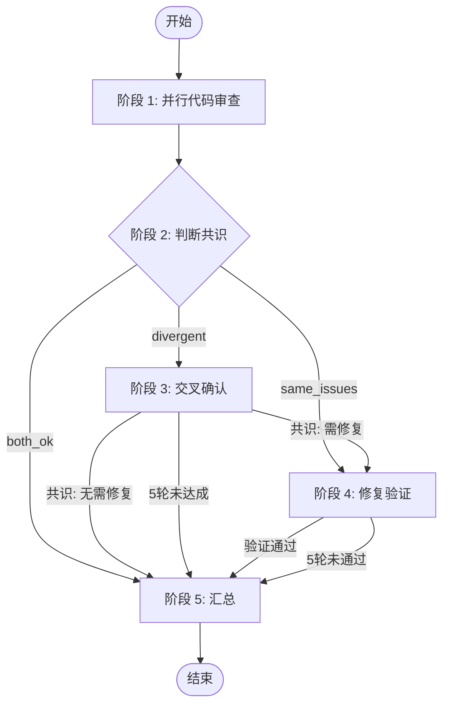

# Code Review - 双 Agent 交叉审查

你在 Hive runtime 中执行一个“Orchestrator + Opus + Codex”的 staged code review workflow。

## 1. 启动检测

优先顺序：

1. 先执行 `hive current`
2. 若已有 `team/workspace/agent`，继续用 Hive 命令
3. 若没有 team 但在 tmux 中，执行 `hive init`
4. 然后执行 `hive team`

始终以 `hive current` 的输出为准绳。

## 2. Review 模式

支持三种 review 模式。Orchestrator 在阶段 1 的 request 里必须明确写出模式与 diff 命令，reviewer 严格按 request 执行：

1. **PR / base branch compare**
   - `git -C <repo> diff <base>...<branch>`
   - 若已有 PR 号且 `gh` 可用，可用 `gh pr diff <number>`
2. **Working directory**
   - `git -C <repo> diff`
   - `git -C <repo> diff --cached`
   - `git -C <repo> status -s`
3. **Commit / range**
   - `git -C <repo> show <commit>`
   - 或 `git -C <repo> diff <from>..<to>`

## 3. 角色

| 角色 | 建议模型/CLI | 职责 |
| ---- | ------------ | ---- |
| **Orchestrator** | 当前 agent | 编排流程、判断共识、决定下一步 |
| **Opus** | Claude / 高上下文 reviewer | 审查、交叉确认、执行修复 |
| **Codex** | Codex / 精确 reviewer | 审查、交叉确认、验证修复 |

## 4. 流程总览



### 阶段执行

**每个阶段执行前，必须先读取对应角色的 `stages/` 文件获取详细指令。**

| 阶段 | Orchestrator | Opus | Codex |
| ---- | ------------ | ---- | ----- |
| 1 | `1-review-orchestrator.md` | `1-review-opus.md` | `1-review-codex.md` |
| 2 | `2-judge-consensus-orchestrator.md` | (不参与) | (不参与) |
| 3 | `3-cross-confirm-orchestrator.md` | `3-cross-confirm-opus.md` | `3-cross-confirm-codex.md` |
| 4 | `4-fix-verify-orchestrator.md` | `4-fix-verify-opus.md` | `4-fix-verify-codex.md` |
| 5 | `5-summary-orchestrator.md` | (不参与) | (不参与) |

## 5. 通信架构

```mermaid
flowchart TB
    subgraph Agents
        Orchestrator[Orchestrator]
        Opus[Opus]
        Codex[Codex]

        Orchestrator <-->|hive send / status| Opus
        Orchestrator <-->|hive send / status| Codex
        Opus <-->|hive send| Codex
    end

    Workspace[(workspace/artifacts + status)]
    Agents --> Workspace
    Agents -->|UI| GitHub[gh pr comment/review\\n(PR 模式可选)]
```

- **阶段 1/4**：reviewer 通过 `hive status-set done ... --meta artifact=<path>` 回传结果
- **阶段 3**：Opus 与 Codex 直接用 `hive send` 对话，最终由 Opus 回传共识
- **Artifact** = 真正的 durable 输出；`hive send` 主要用于任务分配、追问、交叉确认
- **PR 评论** = 纯 UI（只在 PR 模式且 `gh` 可用时使用）

### 消息格式

Agent 间消息统一使用 `hive send`，Hive 会自动注入 `<HIVE ...> ... </HIVE>` 包络：

```bash
hive send codex "请阅读 /tmp/hive-xxx/artifacts/codex-request.md"
hive send opus "交叉确认 C1/C2，见 artifact: /tmp/hive-xxx/artifacts/s3-input.md"
```

完成态只用 status + artifact 回传，一条 `status-set done` 即可。

## 6. Request 契约

阶段 1 发给 reviewer 的 request 至少要写清：

- Mode
- Repo Path
- Subject
- Diff Commands
- Output Artifact
- Done Command
- （PR 模式可选）PR Number / Base / Branch
- （Fix 阶段可选）Validator Commands

reviewer 只执行 request 里明确写出的 diff 命令。

## 7. Orchestrator 行为规范

**角色：监督者 + 仲裁者**

- 启动流程，分配任务
- 通过 `hive wait-status`、artifact、`hive status` 判断下一步
- 在阶段 2 决定是直接修复还是进入交叉确认
- 在阶段 4 控制修复/验证轮次

**边界：**

- 阶段 1-4 只做编排和仲裁，审 diff 的事交给 reviewer
- reviewer artifact 只有 reviewer 自己写
- “需要别人回复”的内容走 `hive send`，status 只放自身状态

**职责：**

- 阶段切换时更新自己的 status
- 等待 reviewer 时用 `hive wait-status`
- 只在阶段 5 汇总时生成统一结论

## 8. CLI 命令

| 命令 | 用途 | 示例 |
| ---- | ---- | ---- |
| `hive current` | 查看当前 Hive 上下文 | `hive current` |
| `hive team` | 查看团队成员 | `hive team` |
| `hive init` | 从当前 tmux window 初始化 team | `hive init` |
| `hive spawn <agent>` | 启动 reviewer pane | `hive spawn opus --cli claude --workflow code-review` |
| `hive workflow load <agent> code-review` | 给已有 reviewer 加载 workflow | `hive workflow load codex code-review` |
| `hive send <agent> <msg>` | 发任务 / 追问 / 共识消息 | `hive send codex "review request in artifact"` |
| `hive status-set ...` | 发布阶段状态 | `hive status-set busy "stage-1" --task code-review --activity launch` |
| `hive status` | 查看 published statuses | `hive status` |
| `hive wait-status <agent> --state done ...` | 等待 reviewer 完成 | `hive wait-status opus --state done --meta stage=s1` |
| `git diff/show/status` | 读取变更 | `git -C /repo diff origin/main...HEAD` |
| `gh pr diff/comment/review` | PR 模式的人类可见输出 | `gh pr comment 123 --body-file summary.md` |

## 9. Workspace Keys

建议把以下 key 写入 `$WORKSPACE/state/` 目录（普通文本文件即可）：

```plain
review-mode
review-subject
review-base
review-branch
review-commit
review-range
review-repo-path
review-pr
s2-result
s4-round
review-summary-artifact
```

这些 key 不是 Hive 内建命令，而是 workflow 约定；必要时直接用 shell 重定向读写。
