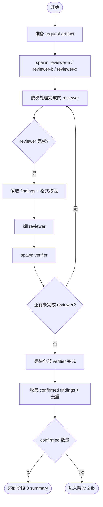

# 阶段 1: 审查 + 验证流水线 - Orchestrator

## 概述

Spawn 3 个 reviewer 并行审查。每个 reviewer 完成后立即 kill 并 spawn 一个 verifier 验证其 findings，实现 review 和 verification 的并行流水线。



## 准备

```bash
CTX_JSON=$(hive current)
WORKSPACE=$(printf '%s' "$CTX_JSON" | python3 -c 'import json,sys; print(json.load(sys.stdin).get("workspace",""))')

mkdir -p "$WORKSPACE/artifacts" "$WORKSPACE/state"

# 清理上次残留的 status 文件（防止 wait-status 命中旧状态）
rm -f "$WORKSPACE/status/"*.json

# 记录 review 上下文（按实际情况替换）
printf '%s' 'pr' > "$WORKSPACE/state/review-mode"
printf '%s' '/absolute/path/to/repo' > "$WORKSPACE/state/review-repo-path"
printf '%s' 'PR #123' > "$WORKSPACE/state/review-subject"

# 生成 3 份 request artifact
for reviewer in reviewer-a reviewer-b reviewer-c; do
  out="$WORKSPACE/artifacts/${reviewer}-r1.md"
  req="$WORKSPACE/artifacts/${reviewer}-request.md"
  cat > "$req" <<EOF
Mode: pr
Repo Path: /absolute/path/to/repo
Subject: PR #123
Diff Commands:
- git -C /absolute/path/to/repo fetch origin main
- git -C /absolute/path/to/repo diff origin/main...HEAD
Output Artifact: $out
Done Command: hive status-set done "review complete" --task code-review --meta stage=s1 --meta reviewer=${reviewer} --meta artifact=$out --meta verdict=<ok|issues>
Validator Commands:
- PYTHONPATH=src python -m pytest tests/ -q
EOF
done

hive status-set busy --task code-review --activity launch-reviews
```

## Spawn reviewer

```bash
hive spawn reviewer-a --cli droid --model custom:Claude-Opus-4.6-0 --workflow code-review
hive spawn reviewer-b --cli droid --model custom:GPT-5.4-1 --workflow code-review
hive spawn reviewer-c --cli droid --model custom:Claude-Opus-4.6-0 --workflow code-review

hive layout main-vertical
hive team
```

## 发送 request

```bash
hive send reviewer-a "阶段 1 review：执行 request artifact $WORKSPACE/artifacts/reviewer-a-request.md，完成时仅用其中的 Done Command 回传。"
hive send reviewer-b "阶段 1 review：执行 request artifact $WORKSPACE/artifacts/reviewer-b-request.md，完成时仅用其中的 Done Command 回传。"
hive send reviewer-c "阶段 1 review：执行 request artifact $WORKSPACE/artifacts/reviewer-c-request.md，完成时仅用其中的 Done Command 回传。"
```

## 流水线处理

**严格按以下循环执行。每个 reviewer 完成后，必须立即 spawn verifier 再去等下一个 reviewer。禁止等完所有 reviewer 再统一处理。**

对 reviewer-a、reviewer-b、reviewer-c **逐个**执行下面 4 步：

### 步骤 1: 等待该 reviewer 完成

```bash
hive wait-status reviewer-a --state done --meta stage=s1 --timeout 1800
```

### 步骤 2: 读取 findings + 格式校验

读取该 reviewer 的 artifact，丢弃缺少 File/Code/Verify 的 finding。

### 步骤 3: Kill reviewer，spawn verifier

如果有 ≥1 条合格 finding，生成 verify task artifact 并立即 spawn verifier：

```bash
cat > "$WORKSPACE/artifacts/verifier-a-verify-task.md" <<EOF
# Verification Task
(reviewer-a 的合格 findings，包含 File/Code/Verify)
Output Artifact: $WORKSPACE/artifacts/verifier-a-verify-result.md
Done Command: hive status-set done "verify complete" --task code-review --meta stage=s1-verify --meta verifier=verifier-a --meta artifact=$WORKSPACE/artifacts/verifier-a-verify-result.md
EOF

hive kill reviewer-a
hive spawn verifier-a --cli droid --model custom:GPT-5.4-1 --workflow code-review
hive send verifier-a "evidence verification：执行 verify task $WORKSPACE/artifacts/verifier-a-verify-task.md，完成时仅用其中的 Done Command 回传。"
```

如果 0 条合格 finding，只 kill reviewer，不 spawn verifier。

### 步骤 4: 立即回到步骤 1，等下一个 reviewer

**不要等 verifier 完成。** verifier 在后台运行，与下一个 reviewer 的 wait 并行。

---

**示例时序**（正确行为）：

```
wait reviewer-a → done → kill reviewer-a → spawn verifier-a → 【立刻】
wait reviewer-b → done → kill reviewer-b → spawn verifier-b → 【立刻】
wait reviewer-c → done → kill reviewer-c → spawn verifier-c
→ 此时 verifier-a / verifier-b 可能已经完成
```

**错误行为**（禁止）：

```
wait reviewer-a → kill
wait reviewer-b → kill
wait reviewer-c → kill
然后才 spawn verifier    ← 禁止！这不是流水线
```

## 等待全部 verifier

在所有 reviewer 处理完毕后，等待实际 spawn 了的 verifier：

```bash
hive wait-status verifier-a --state done --meta stage=s1-verify --timeout 1800
hive wait-status verifier-b --state done --meta stage=s1-verify --timeout 1800
hive wait-status verifier-c --state done --meta stage=s1-verify --timeout 1800
```

（只等实际 spawn 了的 verifier。）

## 收集 + 去重

读取所有 verifier 的 result artifact，提取 `confirmed` 的 findings。多个 reviewer 报了同一问题的，合并为一条。

```bash
cat > "$WORKSPACE/artifacts/confirmed-findings.md" <<EOF
# Confirmed Findings
(去重后的 confirmed findings)
EOF

printf '%s' '<confirmed 数量>' > "$WORKSPACE/state/confirmed-count"
```

## Kill verifier

```bash
hive kill verifier-a
hive kill verifier-b
hive kill verifier-c
```

## 分支

- confirmed = 0 → 跳到阶段 3（summary）
- confirmed > 0 → 进入阶段 2（fix）
