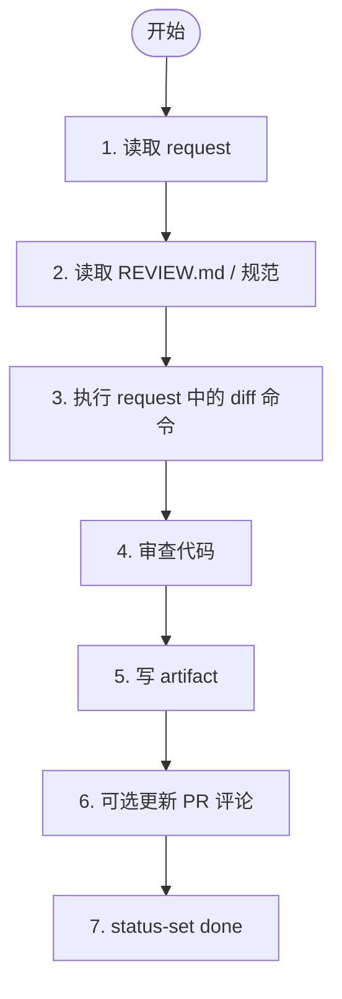

# 阶段 1: 代码审查 - Codex

审查 request 指定的变更，输出 artifact，并用 `hive status-set` 回传给 Orchestrator。



## 1. 读取 request

读取 orchestrator 指定的 request artifact。若缺少关键字段，立即失败回传，不要自己补默认值。

## 2. 读取 REVIEW.md / 规范

若仓库根目录有 `REVIEW.md`，先读它；没有就直接按变更审查。

## 3. 获取 diff

只执行 request 中写明的 diff 命令；不要擅自更换 base / branch / commit。

## 4. 审查代码

### Review 原则

- 只提作者知道后大概率会修的问题
- 不要因为风格偏好制造 findings
- 结论要能指向具体文件/行为
- 若没有离散且可操作的问题，宁可给出 `No issues found`

### Priority Levels

- 🔴 [P0] Blocking
- 🟠 [P1] Urgent
- 🟡 [P2] Normal
- 🟢 [P3] Low

## 5. 写 artifact

输出 artifact 模板：

```markdown
# Codex Review

## Summary
- Mode:
- Subject:
- Scope:

## Findings
1. [P?] 标题
   - File:
   - Why:
   - Evidence:

## Risks

## Follow-up

## Conclusion
✅ No issues found / Highest priority: P?
```

## 6. 可选 PR 评论

仅在 PR 模式且 `gh` 可用时，允许用 marker 发布评论：

```markdown
<!-- hive-review-codex-r1 -->
## Codex Review
```

## 7. 通知 Orchestrator

用 request 中的 Done Command 回传；至少带上：

- `stage=s1`
- `reviewer=codex`
- `artifact=<artifact path>`
- `verdict=ok|issues`

非必要不要再补一条重复的完成消息。
