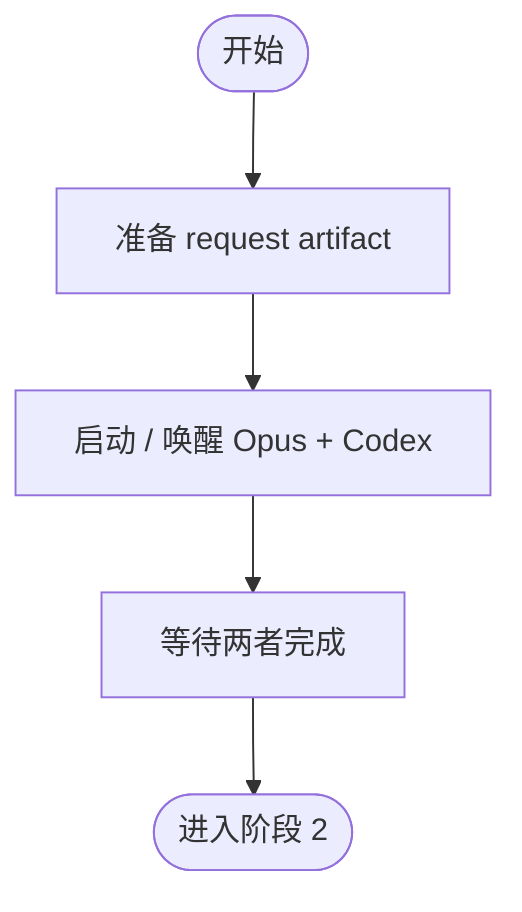

# 阶段 1: 并行代码审查 - Orchestrator

## 概述

启动 Opus 和 Codex 并行审查同一组变更。



## 任务

1. 解析 workspace 与 review 上下文
2. 为 Opus / Codex 生成独立 request artifact
3. 启动或唤醒两个 reviewer
4. 等待两者以 `stage=s1` 完成

## 执行

```bash
CTX_JSON=$(hive current)
WORKSPACE=$(printf '%s' "$CTX_JSON" | python3 -c 'import json,sys; print(json.load(sys.stdin).get("workspace",""))')

mkdir -p "$WORKSPACE/artifacts" "$WORKSPACE/state"

printf '%s' 'pr' > "$WORKSPACE/state/review-mode"
printf '%s' '/absolute/path/to/repo' > "$WORKSPACE/state/review-repo-path"
printf '%s' 'PR #123' > "$WORKSPACE/state/review-subject"
printf '%s' 'main' > "$WORKSPACE/state/review-base"
printf '%s' 'feature-branch' > "$WORKSPACE/state/review-branch"
printf '%s' '123' > "$WORKSPACE/state/review-pr"

for reviewer in opus codex; do
  out="$WORKSPACE/artifacts/${reviewer}-r1.md"
  req="$WORKSPACE/artifacts/${reviewer}-request.md"
  cat > "$req" <<EOF
Mode: pr
Repo Path: /absolute/path/to/repo
Subject: PR #123
Diff Commands:
- git -C /absolute/path/to/repo fetch origin main
- git -C /absolute/path/to/repo diff origin/main...HEAD
Output Artifact: $out
Done Command: hive status-set done "review complete" --task code-review --activity ${reviewer}-r1-done --meta stage=s1 --meta reviewer=${reviewer} --meta artifact=$out --meta verdict=<ok|issues>
Validator Commands:
- PYTHONPATH=src python -m pytest tests/ -q
EOF
done

hive status-set busy "stage-1" --task code-review --activity launch-reviews

hive spawn opus --cli claude --workflow code-review
hive spawn codex --cli codex --workflow code-review

hive send opus "阶段 1：读取 ~/.factory/skills/code-review/stages/1-review-opus.md，并按 request artifact 执行：$WORKSPACE/artifacts/opus-request.md"
hive send codex "阶段 1：读取 ~/.factory/skills/code-review/stages/1-review-codex.md，并按 request artifact 执行：$WORKSPACE/artifacts/codex-request.md"
```

## 等待

```bash
hive wait-status opus --state done --meta stage=s1 --meta reviewer=opus --timeout 1800
hive wait-status codex --state done --meta stage=s1 --meta reviewer=codex --timeout 1800
```

两个 reviewer 都完成后，进入阶段 2。
