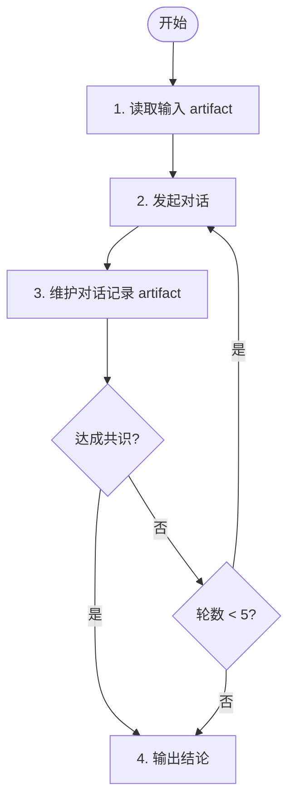

# 阶段 3: 交叉确认 - Opus

和 Codex 直接对话，对每个有分歧的问题达成共识。



## 你的职责

1. 创建并维护交叉确认 artifact（对话记录 + 结论）
2. 与 Codex 通过 `hive send` 直接对话
3. 达成共识后通知 Orchestrator

## 1. 准备 artifact

建议输出到：`$WORKSPACE/artifacts/s3-consensus.md`

模板：

```markdown
# Cross Confirm

## Transcript
- Opus: ...
- Codex: ...

## Conclusion
| Issue | Status | Note |
| ----- | ------ | ---- |
| C1 | Fix / Skip / Deadlock | ... |
```

## 2. 发起对话

首条消息只讨论“存在分歧的 finding”，不要重新做整轮 review。

```bash
hive send codex "阶段 3：读取 ~/.factory/skills/code-review/stages/3-cross-confirm-codex.md。我们需要确认以下问题：..."
```

## 3. 对话规则

- 每轮只处理有限个争议点
- 每条回复明确写 `Fix` / `Skip` / `Deadlock`
- 最多 5 轮
- 不要引入全新 finding，除非它是当前争议点的直接前提

## 4. 通知 Orchestrator

结束时回传：

```bash
hive status-set done "cross confirm complete" \
  --task code-review \
  --activity cross-confirm-done \
  --meta stage=s3 \
  --meta artifact=/tmp/hive-xxx/artifacts/s3-consensus.md \
  --meta result=fix
```

其中 `result` 只能是：

- `fix`：至少一个问题确认需要修复
- `skip`：全部确认无需修复
- `deadlock`：5 轮后仍有分歧
