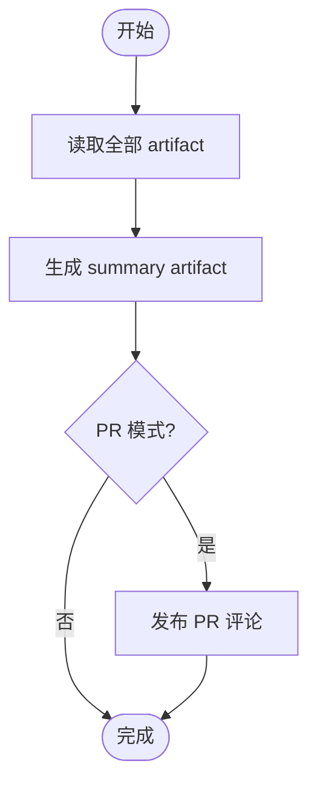

# 阶段 3: 汇总 - Orchestrator

## 概述

读取全部 artifact，生成最终 review summary。



## 汇总

以下示例中的 `ARTIFACT_DIR` / `STATE_DIR` 仍然沿用当前 review run 的目录。

读取：

- `$ARTIFACT_DIR/reviewer-a-r1.md`, `$ARTIFACT_DIR/reviewer-b-r1.md`, `$ARTIFACT_DIR/reviewer-c-r1.md`（S1 原始审查）
- `$ARTIFACT_DIR/verifier-*-verify-result.md`（S1 验证结果）
- `$ARTIFACT_DIR/confirmed-findings.md`（确认的 findings）
- `$ARTIFACT_DIR/s2-fix-round-*.md` / `$ARTIFACT_DIR/s2-verify-round-*.md`（若存在）

## 生成 summary artifact

```markdown
# Code Review Summary

## Timeline
- Stage 1: 3 reviewer 并行审查 + evidence verification 流水线
- Stage 2: 修复验证 → pass/fail/skipped

## Confirmed Findings
| # | 问题 | 状态 |
| - | ---- | ---- |
| C1 | ... | Fixed ✅ / Unfixed ❌ |

## Discarded (evidence fabricated)
| # | 问题 | 原因 |
| - | ---- | ---- |

## Reviewer Conclusions
- Reviewer A: ...
- Reviewer B: ...
- Reviewer C: ...

## Final Conclusion
✅ No issues found / ⚠️ Issues found and fixed / ❌ Issues remain unfixed
```

写入：

```bash
printf '%s' "$ARTIFACT_DIR/review-summary.md" > "$STATE_DIR/review-summary-artifact"
```

## 可选 PR 评论

仅在 `Mode: pr` 且 `gh` 可用时：

```bash
gh pr comment <number> --body-file "$ARTIFACT_DIR/review-summary.md"
```

## 完成

输出 summary 到 pane 即可。整个 review workflow 结束。
